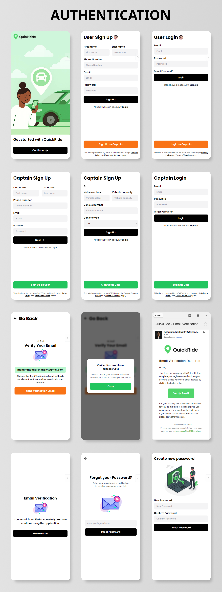
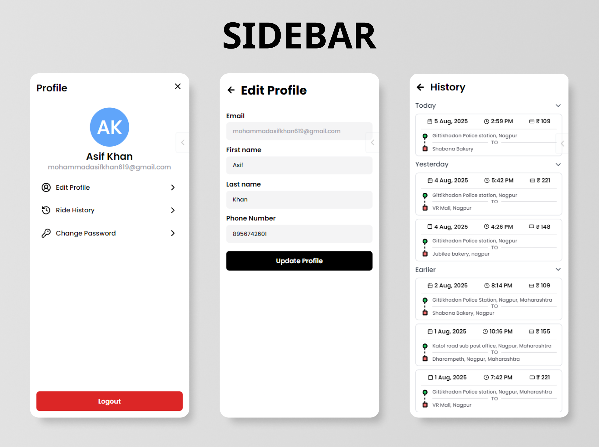
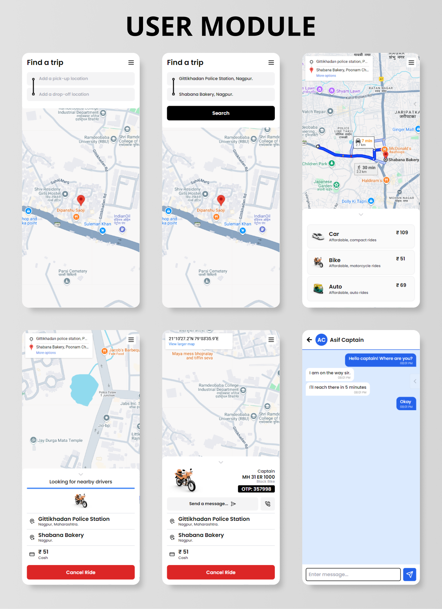
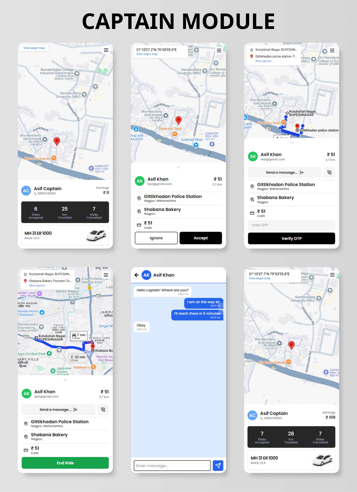

<div align="center">
    
</div>

# QuickRide

QuickRide is a ride-sharing web and mobile application that allows users to book rides easily, view available drivers, and track trips in real-time.

---

## 🚀 Setup Instructions

Follow these steps to get the project running locally:

### **Frontend**
1. Navigate to the frontend folder:
   ```bash
   cd Frontend
2. Install dependencies:
   npm install

3. Install Capacitor:
   npm install @capacitor/core @capacitor/cli
   npx cap init

4. Build your React app:
   npm run build

5. Copy build files to Capacitor:
    npx cap add android
    npx cap add ios
    npx cap copy
    npx cap open android   # opens in Android Studio
    npx cap open ios

 6. Connect with your backend
    cd Backend
    npm start

## ⚙️ Tech Stack

| **Category**       | **Technologies / Tools**                                              |
| ------------------ | --------------------------------------------------------------------- |
| **Frontend**       | HTML, CSS, React Native, Tailwind CSS, Google Maps, Android, ios      |
| **Backend**        | Node.js, Express.js, MongoDB, Socket IO, NodeMailer, Google Maps APIs |
| **Authentication** | JWT (JSON Web Token), bcrypt                                          |
| **Deployment**     | Vercel, Render                                                        |
| **Dev Tools**      | Postman, npm, Nodemon, ESLint, Custom Logger                          |


---

## ✨ Mobile App Features

### 🔐 Authentication & Authorization

- Secure email/password login with full form validation
- Email verification and logout functionality
- Forgot and change password support
- Role-based access control (User and Captain)
- Session handling and route protection (unauthorized access is blocked)

### 🧑🏻 User Management

- Edit personal profile details (name, email, phone)
- Ride history tracking
- Form validation for all user inputs

### 📍 Location & Mapping

- Pickup and destination selection with address auto-complete
- Real-time location tracking on interactive maps
- Route visualization with distance and estimated time calculation

### 🚖 Ride Booking System

- Supports multiple ride types: Car, Bike, and Auto
- Live ride status updates: Pending, Accepted, Ongoing, Completed, Cancelled
- Concurrency control: A ride request can only be accepted by one captain
- Automatic ride cancellation after timeout
- Accurate fare estimation based on distance and time

### 🔄 Real-Time Updates

- Socket-based updates for ride status and live locations
- Real-time in-app chat between rider and captain
- Chat messages are stored in the database with timestamps
- Access control ensures only assigned rider and captain can view the conversation

### 👨‍✈️ Captain (Driver) Interface

- Accept or reject incoming ride requests
- Real-time updates for trip progress
- Role-specific access to ride-related actions

### 🧰 System Utilities

- Custom logger to persist frontend and backend logs in the database
- Force reset feature to clear all local app data and recover from unstable states
- Popup alert system for immediate feedback (success, error, warning)

---

## 🖼️ Screenshots

<details>
<summary>Authentication</summary>



</details>

<details>
<summary>Sidebar Navigation</summary>



</details>

<details>
<summary>User Module</summary>



</details>

<details>
<summary>Captain Module</summary>



</details>

---

## 📝 License

This project is licensed under the [MIT License](LICENSE).
